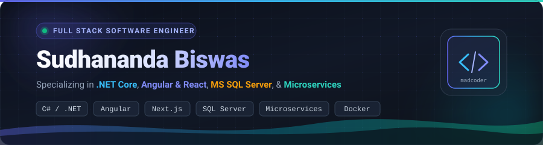
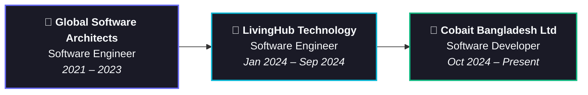

<!-- Hero Banner -->

  

<!-- Dynamic Typing Subtitle -->

  
  
  
  
  

---

### 👨‍💻 About Me

Hello! I'm **Sudhananda Biswas** (often coding as **`madcoderBubt`**), a results-driven **Full Stack Software Engineer** based in Dhaka, Bangladesh 🇧🇩. 

Currently working as a **Software Developer at [Cobait Bangladesh Ltd](https://biztraq.com/)**, I have 4+ years of hands-on experience building mission-critical enterprise applications, optimizing high-volume relational databases, and architecting decoupled microservices.

- 💼 **Current Role**: Software Developer @ **[Cobait Bangladesh Ltd](https://biztraq.com/)**
- 🚀 **Community**: Co-Founder & Active Contributor @ **[MadCodersBD](https://github.com/MadCodersBD)**
- 💡 **Core Strengths**: C#, ASP.NET Core, Angular, Next.js, T-SQL (MS SQL Server), PostgreSQL, CQRS & MediatR, and Clean Architecture
- 🧩 **Competitive Problem Solving**: Active problem solver on **[LeetCode](https://leetcode.com/madcoderBubt/)** | Ranked in **Top 15** at BUBT Intra-University Programming Contest
- 🎓 **Education**: B.Sc. in Computer Science & Engineering from **Bangladesh University of Business & Technology (BUBT)**
- 🌱 **Currently Exploring**: Cloud Native Architectures, Distributed Microservices with Docker, and Advanced System Design
- 💬 **Ask Me About**: .NET Core, Microservices, Stored Procedure Optimization, Clean Architecture, Angular/React, and Full-Stack Engineering

---

### 🛠️ Tech Stack & Skills

<table>
  <tr>
    <td align="center" width="22%"><strong>Languages</strong></td>
    <td>
      
      
      
      
      
      
    </td>
  </tr>
  <tr>
    <td align="center"><strong>Backend & Arch</strong></td>
    <td>
      
      
      
      
      
      
      
    </td>
  </tr>
  <tr>
    <td align="center"><strong>Frontend</strong></td>
    <td>
      
      
      
      
      
      
      
    </td>
  </tr>
  <tr>
    <td align="center"><strong>Databases</strong></td>
    <td>
      
      
      
    </td>
  </tr>
  <tr>
    <td align="center"><strong>DevOps & Tools</strong></td>
    <td>
      
      
      
      
      
      
    </td>
  </tr>
</table>

---

### 📌 Featured Projects

| Project | Tech Stack | Highlights | Links |
| :--- | :--- | :--- | :--- |
| 🛒 **[Book Store](https://github.com/madcoderBubt/BookStore)** | `ASP.NET Core MVC` `C#` `EF Core` `MS SQL Server` `ASP.NET Identity` `Bootstrap` | An end-to-end e-commerce platform for book purchases with role-based authentication, cart handling, and order checkout pipelines. | [🔗 Repository](https://github.com/madcoderBubt/BookStore) |
| ⚙️ **[ASP.NET Microservice](https://github.com/madcoderBubt/AspNetMicroservice)** | `.NET Core` `Docker` `PostgreSQL` `MS SQL` `MongoDB` `CQRS` | Distributed microservices architecture with decoupled service boundaries, containerization via Docker, and polyglot persistence. | [🔗 Repository](https://github.com/madcoderBubt/AspNetMicroservice) |
| 🌐 **[Developer Portfolio](https://github.com/madcoderBubt/PortfolioWithBlazor)** | `Next.js` `Blazor` `Tailwind CSS` `TypeScript` | Personal developer portfolio showcasing experience, projects, skills, and interactive live touchpoints. | [🔗 Repository](https://github.com/madcoderBubt/PortfolioWithBlazor) · [🌐 Live Demo](https://portfolio-zeta-six-aw591ztrru.vercel.app/) |

#### 🏢 Enterprise Projects & Contributions
- **Event Management System**: Scaled for international clients [Strictly FX](https://www.strictlyfx.com/) & [Event One FX](https://e1fx.com).
- **Route Optimization Service**: Vehicle and route optimization engine for [Autoguard](https://www.autoguardtracking.com/) client (AH Khan & Co. Ltd.).
- **Apartment Management System**: Built with modern CQRS & MediatR pipelines for [LivingHub Technology](https://app.livinghub.tech/).
- **Warehouse Management System**: Inventory and tracking system for US-based manufacturing client.

---

### 💼 Career Journey

- **Software Developer** @ **[Cobait Bangladesh Ltd](https://biztraq.com/)** *(Oct 2024 – Present)*
  - Developing and enhancing enterprise platform features with modern architecture and reusable modular components.
  - Improving user experience and application responsiveness with Angular, .NET, SignalR, and Kendo UI.
- **Software Engineer** @ **[LivingHub Technology](https://app.livinghub.tech/)** *(Jan 2024 – Sep 2024)*
  - Engineered decoupled backend microservices with ASP.NET Core Web API and PostgreSQL.
  - Implemented CQRS design pattern with MediatR to segregate command and query pipelines.
- **Software Engineer** @ **[Global Software Architects](http://globalsoftwarearchitects.net/)** *(Apr 2021 – Dec 2023)*
  - Maintained core enterprise systems with .NET and Angular, and mentored junior developers.
  - Designed and tuned complex T-SQL Stored Procedures in MS SQL Server for high-performance reporting.

---

### 📊 GitHub & Problem Solving Analytics

<table border="0">
  <tr>
    <td align="center" width="50%">
      
    </td>
    <td align="center" width="50%">
      
    </td>
  </tr>
</table>

 

<!-- GitHub Streak Stats -->

  

<!-- LeetCode Stats Card -->

---

### 🤝 Connect & Socials

  

  <i>⭐️ Designed with passion & precision by <a href="https://github.com/madcoderBubt">Sudhananda Biswas</a></i>

